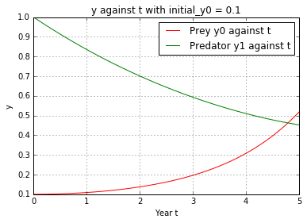
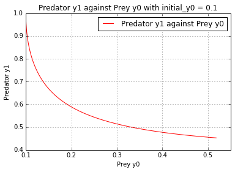
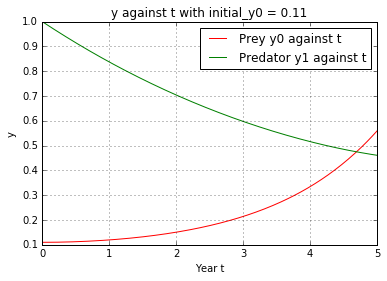
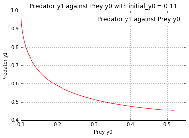

UECM3033 Assignment #3 Report
========================================================

- Prepared by: ** Hing Ming Xuan**
- Tutorial Group: T2

--------------------------------------------------------

## Task 1 --  Gauss-Legendre formula

The reports, codes and supporting documents are to be uploaded to Github at: 

[https://github.com/HingMingXuan/UECM3033_assign3](https://github.com/HingMingXuan/UECM3033_assign3)

Explain how you implement your `task1.py` here.

In task 1, the integrate function with N-point Gauss-Legendre quadrature was approximated by import the numpy and sy function.
The define function gausslegendre will take in function, f(x), with lower and 
upper limit, a, b and n. The defined function named gausslegendre(f, a, b, n=20) 
is to fix the number of noded, weight and positions of nodes to be accurate.
The answer is set to be 0 initially. By using the np.polynomial.legendre.leggauss(n) 
to computes the weights(w) and nodes(x) for Gauss-Legendre quadrature by using number of nodes(n) = 20.
An integral over [a,b] must be changed into an integral over [-1,1] before applying the the Gaussian quadrature rule.
The interval transformation can be done in the following equation.
transformed_x = (b-a)*x/2+((b+a)/2) as show in the task 1.py.
The answer can be calculated out by using the Gauss-Legendre Quadrature formula:
ans = ((b-a)/2)*sum(w*f(transformed_x)) which (b-a)/2 is the jacobian of the transformation.

Explain how you get the weights and nodes used in the Gauss-Legendre quadrature.

The weights and nodes used in the Gauss-Legendre quadrature can be obtained by numpy.polynomial.legendre.leggauss. 
The fuction is x,w = np.polynomial.legendre.leggauss(n)

---------------------------------------------------------

## Task 2 -- Predator-prey model

Explain how you implement your `task2.py` here, especially how to use `odeint`.
In task 2, numpy, scipy and matplotlib.pyplot was import from library.
A ODE system (ode) which has 4 parameters (y, t, a, b) is created and the following differential equations is defined in the system.
dydt = [a*(y0 - y0*y1),b*(-y1+y0*y1)]
The time from 0 to 5 years is defined by using the linspace function to plot the line graph.
t = np.linspace(0, 5, 200)
To slove the nonlinear ODE system by using the odeint module in python with the function below.
 sol = odeint(ode, initial_y, t, args=(a,b))

Put your graphs here and explain.

This is the graph of Prey y0 and Predator y1 againt Year t, where the initial condition is y0 = 0.1, y1 = 1.0.
The number of prey increase when the number of predator decreases.

This is the graph of Predator y1 against Prey y0, where the initial condition is y0 = 0.1, y1 = 1.0.
There is a inverse relationship between y0 and y1.

This is the graph of Prey y0 and Predator y1 against Year t, where the initial condition is y0 = 0.11, y1 = 1.0.

This is the graph of Predator y1 against Prey y0, where the initial condition is y0 = 0.11, y1 = 1.0

Is the system of ODE sensitive to initial condition? Explain.

The system of ODE is not sensitive to the initial condition. 
From the 2 differntial equations with the graph above where there is not much different between y0=0.1 and 0.11.
Therefore, this system of ODE is not sensitive to the initial condition.

-----------------------------------

last modified: 16/4/2016
